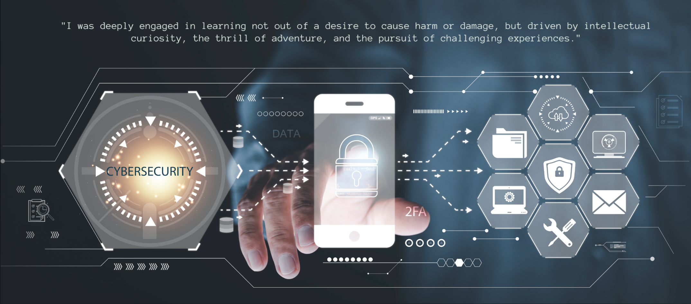

# Personal portfolio


[](https://twitter.com/intent/follow?screen_name=codewithsadee_)
[](https://youtu.be/SoxmIlgf2zM)

agyaat is a fully responsive personal portfolio website designed to work seamlessly across all devices. It is built using HTML, CSS, and JavaScript.

## Cyber Security




## Prerequisites

Before you begin, ensure you have met the following requirements:

* [Git](https://git-scm.com/downloads "Download Git") must be installed on your operating system.

## Installing git

To install git in your macOS, follow these [link](https://git-scm.com/download/mac). 

Linux and macOS:

```bash
sudo git clone https://github.com/iamagyaat/iamagyaat.github.io.git
```

## Contact

If you want to contact me you can reach me at [Twitter](https://x.com/hack3rp0s3).

## License

MIT
